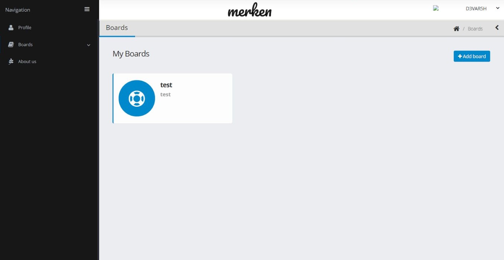

# Merken

 



---

## Introduction

Merken is an online virtual Note-taking book. It allows a user to manage their important notes and organize in a very efficient way.

### Intended​ ​Audience​

Our target audience would really be anyone who is struggling with managing their task and important notes. Merken can be used by individuals, families, students, reporters, bloggers, and many other organizations. And can be used for taking important notes and report

### Project​ ​Scope​

Merken is a visual Note-taking tool that allows individuals (to work on their plan) to take important notes and can access from any corner of the earth. Here users can also note their daily task to organize your day. The virtual interface of boards, lists and cards makes it easy and non-intimidating even for non-technical users and also flexible enough to let users work the best way they know-how.

### Features

- Many of the microsoft word features for writing Notes
- Availability of Font and Style, makes your Notes more readable.
- Hashing of a password makes your account more secure.
- Cloud Storage
- Track your activities
- Link your social media account
- User Friendly Interface
- Mobile friendly View

## Installation

- Download and install [PostgreSQL](https://www.postgresql.org/download/) to setup database.
- Use the package manager [pip](https://pip.pypa.io/en/stable/) to install required dependencies.
- Run below command to install required dependecies.

  ```bash
  pip install -r requirements.tct
  ```

- Run the pgAdmin 4 and create a database with information

  ```bash
  dbname='Merken'
  user='postgres'
  host='localhost'
  password='qwqw'
  ```

- Run each query from maindb.sql file to create the required tables, functions, and triggers.

## Usage

Set Flask App to run.py

```bash
set FLASK_APP=run.py
```

To start development server

```bash
set FLASK_ENV=development
```

To run the flask app

```bash
flask run
```

## License

[MIT](https://choosealicense.com/licenses/mit/)

```

```
